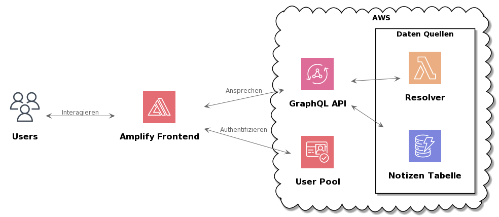

## First day
### First meeting

Becky and I first met at 8am to plan the rest of the day. I already had a lot of the programs I needed installed, so that part didn't take long. The plan was for me to set up my own blog site using a framework called Hugo and summarize my first day as a blog. When I'm done with that, I could move on to React.js.

### Hugo

When we were done with the meeting, I started with Hugo. I used a [Guide](https://levelup.gitconnected.com/build-a-personal-website-with-github-pages-and-hugo-6c68592204c7) to learn how to work with Hugo. Hugo can be installed easily with the package manager Chocolatey. You can create a website with a few commands using a template of choice. This website can be further configured in config.toml. There you define things like the author, description and others. This website can then be hosted on a local server or on e.g. Github Pages. When hosting on Github Pages I had a bug where the CSS was not imported correctly. However, we discussed this in the second meeting and fixed it later by changing the path for importing the CSS.
After that everything worked fine.

### React

When I was done with Hugo and had the website up and running, I moved on to React.js. React.js is a component-based javascript front-end library. React makes it easier to build user interfaces.

To get familiar with React I first followed the [Tutorial](https://reactjs.org/tutorial/tutorial.html#setup-option-2-local-development-environment). In this tutorial you create Tic-Tac-Toe. I followed the tutorial and wrote the following code.

```jsx
function Square(props) {
  return (
    <button className="square" onClick={props.onClick}>
      {props.value}
    </button>
  );
}

class Board extends React.Component {
  renderSquare(i) {
    return (
      <Square
        value={this.props.squares[i]}
        onClick={() => this.props.onClick(i)}
      />
    );
  }

  render() {
    return (
      <div>
        <div className="board-row">
          {this.renderSquare(0)}
          {this.renderSquare(1)}
          {this.renderSquare(2)}
        </div>
        <div className="board-row">
          {this.renderSquare(3)}
          {this.renderSquare(4)}
          {this.renderSquare(5)}
        </div>
        <div className="board-row">
          {this.renderSquare(6)}
          {this.renderSquare(7)}
          {this.renderSquare(8)}
        </div>
      </div>
    );
  }
}

class Game extends React.Component {
  constructor(props) {
    super(props);
    this.state = {
      history: [
        {
          squares: Array(9).fill(null),
        },
      ],
      stepNumber: 0,
      xIsNext: true,
    };
  }

  handleClick(i) {
    const history = this.state.history.slice(0, this.state.stepNumber + 1);
    const current = history[history.length - 1];
    const squares = current.squares.slice();
    if (calculateWinner(squares) || squares[i]) {
      return;
    }
    squares[i] = this.state.xIsNext ? "X" : "O";
    this.setState({
      history: history.concat([
        {
          squares: squares,
        },
      ]),
      stepNumber: history.length,
      xIsNext: !this.state.xIsNext,
    });
  }

  jumpTo(step) {
    this.setState({
      stepNumber: step,
      xIsNext: step % 2 === 0,
    });
  }

  render() {
    const history = this.state.history;
    const current = history[this.state.stepNumber];
    const winner = calculateWinner(current.squares);

    const moves = history.map((step, move) => {
      const desc = move ? "Go to move #" + move : "Go to game start";
      return (
        <li key={move}>
          <button onClick={() => this.jumpTo(move)}>{desc}</button>
        </li>
      );
    });

    let status;
    if (winner) {
      status = "Winner: " + winner;
    } else {
      status = "Next player: " + (this.state.xIsNext ? "X" : "O");
    }

    return (
      <div className="game">
        <div className="game-board">
          <Board
            squares={current.squares}
            onClick={(i) => this.handleClick(i)}
          />
        </div>
        <div className="game-info">
          <div>{status}</div>
          <ol>{moves}</ol>
        </div>
      </div>
    );
  }
}

// ========================================

ReactDOM.render(<Game />, document.getElementById("root"));

function calculateWinner(squares) {
  const lines = [
    [0, 1, 2],
    [3, 4, 5],
    [6, 7, 8],
    [0, 3, 6],
    [1, 4, 7],
    [2, 5, 8],
    [0, 4, 8],
    [2, 4, 6],
  ];
  for (let i = 0; i < lines.length; i++) {
    const [a, b, c] = lines[i];
    if (squares[a] && squares[a] === squares[b] && squares[a] === squares[c]) {
      return squares[a];
    }
  }
  return null;
}
```
## Second day
### Github Actions

First, I learned what [GitHub Actions](https://www.plainconcepts.com/what-is-github-actions/) is and then automated the build and deploy process with Github Actions using a [Guide](https://dev.to/importhuman/deploy-hugo-website-using-github-pages-1mc5) for the website I created with Hugo. However, I ran into a few problems with that and continued with React for now, but I still tried a simpler workflow that outputs something to the terminal on a push.

```yml
name: CI

on:
  push:
    branches: [main]
  pull_request:
    branches: [main]
  workflow_dispatch:

jobs:
  build:
    runs-on: ubuntu-latest
    steps:
      - uses: actions/checkout@v2
      - name: Run a one-line script
        run: echo Hello, world!

      - name: Run a multi-line script
        run: |
          echo Add other actions to build,
          echo test, and deploy your project.
```

### React

I then expanded my React knowledge a bit and tried Forms, programmed a todo list and read data from an [API](https://randomuser.me/) with React. The source code for this is on my [GitHub](https://github.com/KurtSchneider0/ReactjsTests).

## Third day


### HTTP and APIs

First, I took another look at [HTTP Requests](https://developer.mozilla.org/en-US/docs/Web/HTTP/Overview), [APIs](https://zapier.com/learn/apis/), and [REST APIs](https://www.redhat.com/en/topics/api/what-is-a-rest-api).

### GraphQL

After that I went through a [GraphQL Basics Tutorial](https://www.howtographql.com/). With this knowledge I then worked on a [Fullstack GraphQL Tutorial](https://www.howtographql.com/react-apollo/0-introduction/) where I reprogrammed a [Hackernews](https://news.ycombinator.com/) clone ([GitHub Repository](https://github.com/KurtSchneider0/Hackernews-React-Apollo)).
However, I had a bug with node and stopped a bit programming on that project.

### NASA API

When I was looking into APIs, I also came across the [NASA API](https://api.nasa.gov/). I then used the API to make a small [website](https://kurtschneider0.github.io/nasa-api/) that outputs the photo of the day, 5 asteroids near Earth, and 5 photos of the Mars rovers ([GitHub Repository](https://github.com/KurtSchneider0/nasa-api)).

## Fourth day

### GitHub Actions

#### Blog website

The first thing I did was to continue working with GitHub Actions. So I tried again to set up a workflow for the blog site and this time I was able to do it. This is the .yml file for the workflow.

```yml
name: github pages

on:
  push:
    branches:
      - main
  pull_request:

jobs:
  deploy:
    runs-on: ubuntu-18.04
    steps:
      - uses: actions/checkout@v2
        with:
          submodules: true
          fetch-depth: 0

      - name: Setup Hugo
        uses: peaceiris/actions-hugo@v2
        with:
          hugo-version: "0.83.1"

      - name: Build
        run: hugo --minify

      - name: Deploy 🚀
        uses: JamesIves/github-pages-deploy-action@4.1.3
        with:
          branch: gh-pages
          folder: public
```

Dieser Workflow baut die Website mit 'hugo --minify' und deployt dann die in `./public` gebaute Website zu GitHub Pages.

#### NASA API

This workflow builds the website with 'hugo --minify' and then deploys the website built in `./public` to GitHub Pages.

```yml
name: Deploy React Application

on:
  push:
    branches: [main]
  pull_request:
    branches: [main]

jobs:
  build_test:
    runs-on: ubuntu-latest

    strategy:
      matrix:
        node-version: [12.x]

    steps:
      - uses: actions/checkout@v2
      - name: Use Node.js ${{ matrix.node-version }}
        uses: actions/setup-node@v2
        with:
          node-version: ${{ matrix.node-version }}
      - name: npm ci, build and test
        run: |
          npm ci
          npm run build --if-present
          npm test
      - name: deploy to gh-pages
        uses: peaceiris/actions-gh-pages@v3
        with:
          deploy_key: ${{ secrets.ACTIONS_DEPLOY_KEY }}
          publish_dir: ./build
```

The workflow simply builds the React project and then lets you host the built website from the `./build` folder via GitHub Pages.

### Cloud Computing

I also had a quick read through what [cloud computing](https://aws.amazon.com/de/what-is-cloud-computing) to prepare for the next day.

### GraphQL

I then also fixed the GraphQL bug by using a different node version to start the server. I have then completed half of the GraphQL tutorial.

## Fifth day

### AWS

First, I watched an introduction to the AWS Cloud. Then I watched two short tutorials from AWS's Getting Started page. The first one involved creating a [Lambda Function](https://aws.amazon.com/de/getting-started/hands-on/run-serverless-code/) to run a serverless "Hello World" program. The second one has [Face Rekognition](https://aws.amazon.com/de/getting-started/hands-on/detect-analyze-compare-faces-rekognition) to analyze and compare faces.

### GraphQL

I also finished the Hackernews clone after that ([GitHub repository](https://github.com/KurtSchneider0/Hackernews-React-Apollo)).

### Retrospective

I was also briefly present at a retrospective today, where I also briefly introduced myself to the other employees.

## Sixth day

### Cloudformation

First, I briefly reviewed [IaC](https://www.redhat.com/en/topics/automation/what-is-infrastructure-as-code-iac#overview). Then I looked into [Cloudformation](https://docs.aws.amazon.com/AWSCloudFormation/latest/UserGuide/Welcome.html) and did a [workshop](https://docs.aws.amazon.com/AWSCloudFormation/latest/UserGuide/Welcome.html) on it. Cloudformation is a way to use yml templates to configure stacks that then contain multiple AWS services. This is a simple Cloudformation template that creates and configures a stack with an S3 bucket.

```yml
AWSTemplateFormatVersion: "2010-09-09"

Description: AWS CloudFormation workshop

Resources:
  S3Bucket:
    Type: AWS::S3::Bucket
    Properties:
      VersioningConfiguration:
        Status: Enabled
      BucketEncryption:
        ServerSideEncryptionConfiguration:
          - ServerSideEncryptionByDefault:
              SSEAlgorithm: AES256
```
## Seventh day

### AWS CDK

Then I did some quick research on what [AWS CDK](https://docs.aws.amazon.com/cdk/v2/guide/home.html) is. AWS CDK is a way to configure similar to stacks. However, for CDK you use programming languages like TypeScript, where the code is turned into a cloudformation template that is then deployed.

A simple stack with CDK TypeScript can look like this.

```typescript
import * as cdk from "aws-cdk-lib";
import * as lambda from "aws-cdk-lib/aws-lambda";
import * as apigw from "aws-cdk-lib/aws-apigateway";

export class CdkWorkshopStack extends cdk.Stack {
  constructor(scope: cdk.App, id: string, props?: cdk.StackProps) {
    super(scope, id, props);
    const hello = new lambda.Function(this, "HelloHandler", {
      runtime: lambda.Runtime.NODEJS_14_X,
      code: lambda.Code.fromAsset("lambda"),
      handler: "hello.handler",
    });

    new apigw.LambdaRestApi(this, "Endpoint", {
      handler: hello,
    });
  }
}
```

And the lambda function referenced in the code may look like this.

```typescript
exports.handler = async function (event) {
  console.log("request:", JSON.stringify(event, undefined, 2));
  return {
    statusCode: 200,
    headers: { "Content-Type": "text/plain" },
    body: `Hello, CDK! You've hit "${event.path}".\n`,
  };
};
```

The stack in the example would create a new lambda function that outputs "Hello, CDK! You've hit" + the addressed endpoint. Then an API gateway is defined so that the Lambda function is executed when an endpoint of that API is accessed. The stack can now be easily deployed with 'cdk deploy'.


## Eighth day
### Serverless

Today I have looked at [Serverless](https://aws.amazon.com/de/lambda/serverless-architectures-learn-more/). For this, I first looked at various explanations such as on [Serverlessland](https://serverlessland.com/learn). To summarize, Servless means that applications automatically scale and add capacity on demand. This allows one to focus more on buisness logic.

I then started using the [Serverless Workshop](https://superluminar-io.github.io/serverless-workshop/).

### GraphQL

In the GraphQL Hackernews clone, I imported the server with schema and database, so I wanted to briefly try making my own little GraphQL server with [Apollo](https://www.apollographql.com/) and [Prisma](https://www.prisma.io/). I decided to make a small API that allows you to create and retrieve notes, which are then stored in a database. The scheme for this is very simple.

```graphql
type Query {
  getNote(id: ID!): Note!
}

type Note {
  id: ID!
  name: String!
  content: String!
  author: String!
}

input newNoteInput {
  name: String!
  content: String!
  author: String!
}

type Mutation {
  newNote(newNoteInput: newNoteInput!): Note!
}
```

The resolvers are self-explanatory.

```javascript
const getNote = async (parent, { id }, context) => {
  const notes = await context.prisma.note.findMany();
  return notes[id - 1];
};

const newNote = (
  parent,
  { newNoteInput: { name, content, author } },
  context
) => {
  const newNote = context.prisma.note.create({
    data: {
      name: name,
      content: content,
      author: author,
    },
  });
  return newNote;
};
```

For the database I use Sqlite and Prisma. This is the `schema.prisma` file.

```prisma
datasource db {
  provider = "sqlite"
  url      = "file:./dev.db"
}

generator client {
  provider = "prisma-client-js"
}

model Note {
  id      Int    @id @default(autoincrement())
  name    String
  content String
  author  String
}
```

## Ninth day

Today was also my first day in presence at superluminar.

### Serverless

I have finished the Serverless Workshop. In the workshop they made a REST API where you can add and read notes stored in a DynamoDB database.


### Hugo Theme

I also made my own little Hugo theme ([GitHub](https://github.com/KurtSchneider0/colorful-theme)).

### GraphQL AppSync

After that I started an [AppSync Workshop](https://superluminar-io.github.io/serverless-graphql-workshop/#/). In which I create a GraphQL API in AWS.

## Tenth day

### GraphQL AppSync

I have finished the GraphQL API from the workshop. One can use the API to create an article and write a comment. Articles can be written only if one has an account that is in the Blogger group on AWS Cognito. Comments are also checked for inappropriate emojis using the input checker. Articles and comments are also stored in DynamoDB databases.


### Final project

I also thought about the project I want to do in the last week. For this I have read through parts of the documentation for CDK.

## Final project

For the last week the plan was that I will work on a smaller project on my own based on what I already learned and research. I decided to create a notes GraphQL API using AppSync and using Amplify frontend, DynamoDB as database and Cognito for the login system. Amplify provides pre-built UI components that can interact with the API, which cann then also be used on a custom website. I wanted to do the infrastructure for this with CDK.



### CDK

The first two days I spent setting up everything except the frontend with CDK for which I defined the resources in `cdk-final-project-stack.ts`.
```ts
import * as cdk from '@aws-cdk/core';
import * as cognito from '@aws-cdk/aws-cognito';
import * as appsync from '@aws-cdk/aws-appsync';
import * as ddb from '@aws-cdk/aws-dynamodb';
import * as lambda from '@aws-cdk/aws-lambda';

export class CdkFinalProjectStack extends cdk.Stack {
  constructor(scope: cdk.Construct, id: string, props?: cdk.StackProps) {
    super(scope, id, props);

    const userPool = new cognito.UserPool(this, 'notes-user-pool', {
      selfSignUpEnabled: true,
      accountRecovery: cognito.AccountRecovery.EMAIL_ONLY,
      userVerification: {
        emailStyle: cognito.VerificationEmailStyle.CODE
      },
      autoVerify: {
        email: true
      },
      standardAttributes: {
        email: {
          required: true,
          mutable: true
        }
      }
    })

    const userPoolClient = new cognito.UserPoolClient(this, "notes-user-pool-client", {
      userPool
    })

    const api = new appsync.GraphqlApi(this, 'notes-api', {
      name: 'notes-api',
      logConfig: {
        fieldLogLevel: appsync.FieldLogLevel.ALL,
      },
      schema: appsync.Schema.fromAsset('./graphql/schema.graphql'),
      authorizationConfig: {
        defaultAuthorization: {
          authorizationType: appsync.AuthorizationType.API_KEY,
          apiKeyConfig: {
            expires: cdk.Expiration.after(cdk.Duration.days(365))
          }
        },
        additionalAuthorizationModes: [{
          authorizationType: appsync.AuthorizationType.USER_POOL,
          userPoolConfig: {
            userPool,
          }
        }]
      },
    })
    
    const notesLambda = new lambda.Function(this, "lambdaId", {
      runtime: lambda.Runtime.NODEJS_14_X,
      code: lambda.Code.fromAsset('lambda'),
      handler: "main.handler",
    })

    const lambdaDs = api.addLambdaDataSource('notesLambdaDatasource', notesLambda)

    const notesTable = new ddb.Table(this, 'CDKNotesTable', {
      billingMode: ddb.BillingMode.PAY_PER_REQUEST,
      partitionKey: {
        name: 'id',
        type: ddb.AttributeType.STRING,
      },
    })

    notesTable.grantFullAccess(notesLambda)
    notesLambda.addEnvironment('PRODUCT_TABLE', notesTable.tableName)

    lambdaDs.createResolver({
      typeName: "Query",
      fieldName: "listNotes"
    })
    lambdaDs.createResolver({
      typeName: "Query",
      fieldName: "getNote"
    })

    lambdaDs.createResolver({
      typeName: "Mutation",
      fieldName: "newNote"
    })

    lambdaDs.createResolver({
      typeName: "Mutation",
      fieldName: "deleteNote"
    })
  }
}
```

and then defined the GraphQL schema for AppSync in `schema.graphql`.

```graphql
type Note @aws_api_key @aws_cognito_user_pools {
  id: ID!
  name: String!
  content: String!
  author: String!
}

input NoteInput {
  id: ID
  name: String!
  content: String!
  author: String!
}

type Query {
  listNotes: [Note] @aws_api_key @aws_cognito_user_pools
  getNote(id: ID!): Note! @aws_api_key @aws_cognito_user_pools
}

type Mutation {
  newNote(note: NoteInput!): Note!
    @aws_cognito_user_pools(cognito_groups: ["Writer"])
  deleteNote(id: ID!): ID @aws_cognito_user_pools(cognito_groups: ["Writer"])
}
```

Here I also define which mutations and queries can be used by which cognito groups. <br>
As a resolver I have then also used lambda functions an example for that would be this lambda function.

```ts
const AWS = require('aws-sdk')
const ddbClient = new AWS.DynamoDB.DocumentClient()
const { v4: uuid } = require('uuid')
import Note from './Note'

async function createNote(note: Note) {
  if (!note.id) {
    note.id = uuid()
  }
  const paramaters = {
    TableName: process.env.PRODUCT_TABLE,
    Item: note
  }
  try {
    await ddbClient.put(paramaters).promise()
    return note
  } catch (error) {
    console.log('Error: ', error)
    return null
  }
}

export default createNote
```

This Lambda function creates a note using the DynamoDB client that can access the database.

### Amplify

Now the API, Database and Userpool works, but I need to program the frontend, because at the moment you can only interact with the API over the AWS Console.<br> 
To do that I create a react app using `npm create react-app frontend`. I'm then configuring Amplify in `index.js`.
```js
Amplify.configure({
    Auth: {
        region: 'eu-central-1',
        userPoolId: process.env.USERPOOLID,
        userPoolWebClientId: process.env.USERPOOLWEBCLIENTID,
        mandatorySignIn: false,
    }
});

const myAppConfig = {
  'aws_appsync_graphqlEndpoint': process.env.AWS_APPSYNC_GRAPHQLENDPOINT,
  'aws_appsync_region': 'eu-central-1',
  'aws_appsync_authenticationType': 'AMAZON_COGNITO_USER_POOLS',
}
```

You can now use the Amplify UI Components. For React, the one you use to make a login component looks like this.
```jsx
export default function App() {
  return (
    <Authenticator>
      {({ signOut, user }) => (
        <main>
          <h1>Hello {user.username}</h1>
          <button onClick={signOut}>Sign out</button>
        </main>
      )}
    </Authenticator>
  );
}
```
Such a login component will then connect with cognito to acces the userpool. <br>
The entire Code is on the GitHub<br>
Once you have created a user in AWS IAM for Amplify and installed the Amplify package you can now use the GraphQL API using
```js 
graphqlOperation(getNote, { id: id })
```
The functions used to get the data look like this.
```js
const queryGetNote = async (id) => {
  const note = await API.graphql(graphqlOperation(getNote, { id: id }));
  setNote(note);
}
const queryListNotes = async () => {
  const note = await API.graphql(graphqlOperation(listNotes));
  setNote(note);
}
const queryNewNote = async (id, name, content, author) => {
  const note = await API.graphql(graphqlOperation(newNote, {id: id, name: name, content: content, author: author}));
  setNote(note);
}
const queryDeleteNote = async (id) => {
  const note = await API.graphql(graphqlOperation(deleteNote, { id: id }));
  setNote(note);
}
```

You can then have this data rendered with the frontend framework of your choice, I'm using React. This completes the project I wanted to do, I'm already done on Thursday though, so I'll just do other smaller things tomorrow. I put the [frontend](https://github.com/KurtSchneider0/frontend-appsync-notes/) and the [backend with CDK](https://github.com/KurtSchneider0/cdk-appsync-notes) on GitHub.

## Last day

Today is my last day and I still had time, so I did a few smaller things.

### Terraform

During the internship, I was worked more with AWS CDK, but there is another alternative that often requires much less code. It is called Terraform and I wanted to briefly work with it. I first configured a lambda function for testing, that prints "Hello World".

`main.tf`
```tf
terraform {
  required_providers {
    aws = {
      source  = "hashicorp/aws"
      version = "~> 3.27"
    }
  }

  required_version = ">= 0.14.9"
}

provider "aws" {
  profile = "default"
  region  = "eu-central-1"
}
```

`lambda.tf`
```tf
locals {
  lambda_zip_location = "outputs/helloworld.zip"
}

data "archive_file" "init" {
  type        = "zip"
  source_file = "helloworld.py"
  output_path = local.lambda_zip_location
}

resource "aws_lambda_function" "test_lambda" {
  filename      = local.lambda_zip_location
  function_name = "helloworld"
  role          = aws_iam_role.lambda_role.arn
  handler       = "helloworld.helloworld"

  source_code_hash = filebase64sha256(local.lambda_zip_location)

  runtime = "python3.7"
}

```

`lambda-iam.tf`
```tf
resource "aws_iam_role_policy" "lambda_policy" {
  name   = "test_policy"
  role   = aws_iam_role.lambda_role.id
  policy = file("iam/lambda-policy.json")
}

resource "aws_iam_role" "lambda_role" {
  name = "test_role"

  assume_role_policy = file("iam/lambda-assume-policy.json")
}
```

`helloworld.py`
```py
def helloworld(event, context):
    print("Hello World")
```

This can then be easily deployed with `terraform apply` and destroyed again with `terraform destroy`.

### PosgreSQL

I also briefly dove into PosgreSQL again and programmed a schema for a social media application.

```sql
CREATE TABLE USERS (
	id SERIAL PRIMARY KEY,
	first_name TEXT NOT NULL,
	last_name TEXT NOT NULL,
	age INTEGER DEFAULT 20,
	email text UNIQUE NOT NULL
);

CREATE TABLE POSTS (
	id SERIAL PRIMARY KEY,
	title TEXT NOT NULL,
	body text default '...',
	"creatorId" INT REFERENCES USERS(ID) NOT NULL
);

CREATE TABLE COMMENTS (
	id SERIAL PRIMARY KEY,
	message TEXT NOT NULL,
	post_id INT REFERENCES POSTS(ID),
	creator_id INT REFERENCES USERS(ID)
);

CREATE TABLE FAVORITES (
	user_id INT REFERENCES USERS(ID),
	post_id INT REFERENCES POSTS(ID),
	PRIMARY KEY (user_id, post_id)
);

CREATE TABLE FRIENDS (
    user_id1 INT REFERENCES USERS(id),
    user_id2 INT REFERENCES USERS(id),
    primary key (user_id1, user_id2)
);

ALTER TABLE POSTS ADD COLUMN created_at DATE DEFAULT now() - (random() * INTERVAL '100 days');

-- FEED
SELECT P.created_at, P.title, substr(P.body, 1, 30), U.first_name FROM POSTS P
INNER JOIN USERS U ON P."creatorId" = u.id
ORDER BY created_at desc
limit 20;
```
